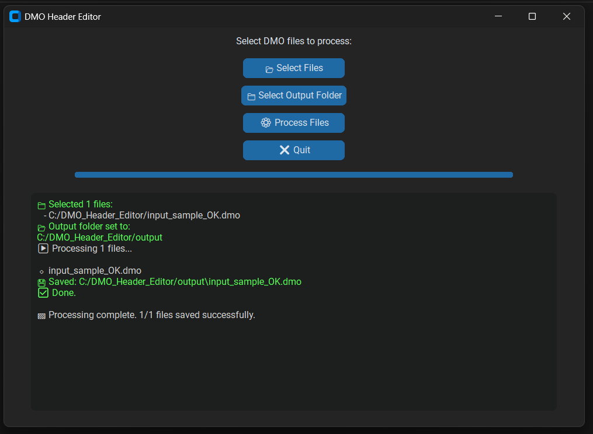

## DMO Header Editor



A lightweight desktop application for parsing, validating, and rebuilding **DMO measurement files** used in automotive quality control.  
The tool automatically reformats and standardizes header sections according to a defined mapping table and validation rules.

---

### Features

- Interactive **CustomTkinter** GUI  
- Batch processing of multiple `.DMO` files  
- Automatic creation of standardized headers  
- Input/output validation with detailed error reporting  
- Visual progress bar and color-coded log messages  
- Configurable output directory

---

### Project Structure

DMO_Header_Editor/
│
├── samples/                   # Sample DMO files (Anonymized)
│   ├── input_sample_OK.dmo    # Original legacy format
│   └── output_sample_OK.dmo   # Standardized output
├── main.py # Entry point – launches the GUI
├── gui.py # Graphical interface and user interaction
├── controller.py # Core logic – validation, merging, saving
├── source.py # File parsing, header creation
├── validator.py # Validation of input and output data
├── Mapping_Table.xlsx # Documentation of transformation rules and headers
├── DMO_icon_flat.ico # Custom application icon
├── README.md # Project documentation
└── LICENSE.txt # Project licence

---

### Requirements

- Python **3.12.7** or higher
- Libraries:
  - `customtkinter >= 5.2.0`
  - *(optional)* `tkinter` – included by default in most Python distributions

---

### Installation

To install dependencies, run:
```bash
pip install customtkinter
```

---

### Usage

1. Clone or download this repository.
2. Run the main script:
```bash
python main.py
```

3. Use the GUI to:
- Select one or more .DMO files
- Choose an output folder
- Start processing

The application will automatically:
- Parse the DMO file header
- Validate required sections
- Rebuild and save standardized files in the chosen folder

---

### Validation Logic

| Check Type        | Description                                             |
| ----------------- | ------------------------------------------------------- |
| Input Validation  | Verifies file structure (header, body, required fields) |
| Info Validation   | Ensures all parsed fields contain valid data            |
| Output Validation | Confirms standardized header format and completeness    |

Files that fail validation are skipped automatically and logged in the output window.

---

### Notes

The program overwrites output files using their original names (no _new suffix).
Files with missing or invalid data are not saved.
Designed for internal use in quality departments handling Wenzel / DMO measurement data.

---

### Author

**Radka Bláhová**
Developed as a personal project to automate and streamline quality control workflows in automotive engineering.
This tool demonstrates my ability to bridge technical engineering requirements with custom software solutions.

---

### License

Distributed under a **Custom License**.  
This software is intended for personal, internal, and non-commercial use only.  
See the `LICENSE` file for full terms.